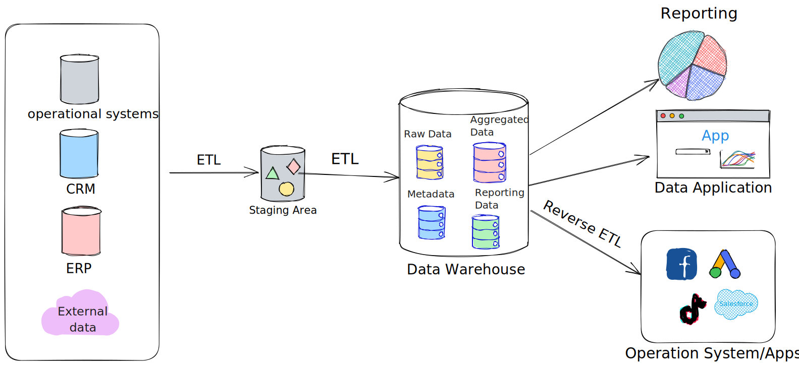

# Why and What is Data Lakehouse

## The Role of Data Engineers in Data Processing and Delivery

As data engineers, our role involves constructing solutions by handling vast volumes of source data. We undertake tasks such as data ingestion, cleansing, normalization, and data merging, all with the aim of presenting a user-friendly data model to downstream applications. However, stakeholders not only require access to the data, but they also demand advanced reporting capabilities for analyzing data over extended periods and performing slicing and dicing based on various business entities. To meet these requirements, two distinct architectural approaches come into play: Data Warehouse and Data Lake.

## Data Warehouse

Traditional data warehouses have served businesses well by providing high-quality, standardized data from various sources for analysis and decision-making. They excel in storing historical data, ensuring reliability through ACID transactions, and leveraging star-schema modeling techniques for business intelligence and reporting. However, the emergence of big data, characterized by its volume, velocity, variety, and veracity, presented challenges for traditional data warehouses. They struggle to handle exponentially increasing data volumes, lack support for real-time streaming architecture, and are not well-suited for semi-structured or unstructured data. Additionally, they lack built-in mechanisms for tracking data trustworthiness and have limited compatibility with data science and machine learning tools. These limitations make traditional data warehouses expensive, difficult to maintain, and unable to meet the evolving needs of modern businesses.


There are proprietary DW like [BigQuery](https://cloud.google.com/bigquery/docs/samples/bigquery-table-insert-rows?utm\_source=devlit.gitbook.io\&utm\_medium=databricks\_for\_data\_engineering\&utm\_campaign=external\_link\&utm\_term=devlit),  [Firebolt](https://www.firebolt.io/?utm\_source=devlit.gitbook.io\&utm\_medium=databricks\_for\_data\_engineering\&utm\_campaign=external\_link\&utm\_term=devlit), and [Snowflake](https://www.snowflake.com/en/?utm\_source=devlit.gitbook.io\&utm\_medium=databricks\_for\_data\_engineering\&utm\_campaign=external\_link\&utm\_term=devlit) that support semi-structured data, streaming inserts, and machine-learning workloads ([BQML](https://cloud.google.com/bigquery/docs/bqml-introduction?utm\_source=devlit.gitbook.io\&utm\_medium=databricks\_for\_data\_engineering\&utm\_campaign=external\_link\&utm\_term=devlit)).


In response to these challenges, a more modern architecture based on the concept of a data lake has emerged. Data lakes address the limitations of traditional data warehouses by providing a scalable and cost-effective solution for storing and analyzing big data.

## Data Lake

Data lakes serve as a centralized repository for consolidating an organization's data assets, offering several advantages. They utilize open formats like Parquet and Avro, ensuring interoperability with a wide range of tools and libraries. Deployed on mature cloud storage systems, data lakes benefit from the scalability, ease of deployment, and cost-effectiveness. They excel in handling diverse data types, including semi-structured and unstructured data, making them suitable for streaming use cases (Web clickstreams) and media processing. Data lakes typically adopt a "schema on read" approach, allowing data to be ingested in any format without immediate schema enforcement. This lack of schema enforcement can give rise to data quality issues, transforming the pristine data lake into a chaotic "data swamp." Additionally, data lakes lack transactional guarantees, limiting data files to append-only operations. As a consequence, updating existing data becomes costly due to the need for rewriting previously written data. This situation leads to the "small file problem," where numerous small files accumulate for a single entity. If not properly managed, these small files hinder read performance, contribute to stale data, and result in wasted storage. To mitigate these issues, data lake administrators must frequently consolidate these smaller files into larger, optimized files for efficient read operations.

Having examined the advantages and limitations of data warehouses and data lakes, it is now time to introduce the concept of the data lakehouse.

## Data Lakehouse

A lakehouse, defined as a data management system that combines the advantages of a data lake and a data warehouse, addresses the limitations of both approaches. By leveraging low-cost and directly-accessible cloud storage, the lakehouse architecture offers the flexibility, scalability, and cost-effectiveness of a data lake, along with the data management capabilities and ACID transactions typically associated with data warehouses. This integration enables the implementation of similar data structures and management features directly on the same storage resources used for traditional data lakes.

### Suitability for Business Intelligence and Machine Learning/AI Use Cases:&#x20;

Data lakehouses offer substantial benefits for both business intelligence and machine learning/AI use cases. They are particularly well-suited for cloud environments with separate computing and storage resources. Spark clusters can run independently while directly accessing the same storage data. Although a data lakehouse is commonly implemented on cloud-based storage(Amazon S3 or Azure ADLS or Google Cloud Storage - GCS), it is conceivable to build it on on-premises systems like HDFS.

### Eliminating Data Duplication and Cost Savings:&#x20;

With the data lakehouse architecture, there is no need for redundant data copies in both the data lake and a separate data warehouse. Instead, data can be served directly from the Data Lake with comparable performance to a traditional data warehouse. This approach offers significant cost savings, both in terms of infrastructure and the associated overhead of managing data movement. Simplified ETL processes and reduced data movement also contribute to improved data quality and quicker development cycles, ultimately leading to reduced time-to-value.

\
